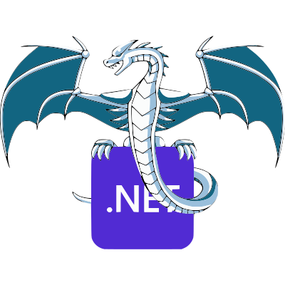

# IL2LLVM



IL2LLVM translates a managed assembly built with this repository's CoreLib into a native object file through LLVM. It is not a .NET runtime, NativeAOT frontend, or a general-purpose replacement for the .NET SDK.

Projects below the repository root build without the framework class library. `Directory.Build.targets` imports `CoreLib/CoreLib.cs` as a shared source file, so the compiled input assembly contains the runtime types used by the translator.

```
C# project + CoreLib
        |
        v
 managed assembly
        |
        v
     IL2LLVM
        |
        v
 native object file + host runtime
        |
        v
 executable or kernel module
```

## Repository layout

| Path | Purpose |
| --- | --- |
| `IL2LLVM/` | The IL-to-LLVM translator. |
| `CoreLib/` | Shared custom CoreLib compiled into managed input assemblies. |
| `ConsoleApp1/` | Managed test program, including language-feature and GC validation. |
| `apphost/` | Minimal C entry point and host implementations for the console test. |
| `LinuxKernelModuleExample/` | Linux x86-64 kernel-module host, linker inputs, and Kbuild Makefile. |

## Build requirements

- .NET 10 SDK
- LLVM native runtime packages restored by `IL2LLVM/IL2LLVM.csproj`
- A native linker and host runtime appropriate for the output target
- For `LinuxKernelModuleExample`: GCC, make, and Linux headers matching the kernel that will load the module

Build the translator:

```powershell
dotnet restore IL2LLVM\IL2LLVM.csproj
dotnet build IL2LLVM\IL2LLVM.csproj --no-restore
```

## IL2LLVM invocation

IL2LLVM requires exactly three arguments:

```text
IL2LLVM <input-assembly> <output-object> <target>[;<code-model>]
```

`target` is an LLVM target triple. The optional code model is one of `default`, `tiny`, `small`, `kernel`, `medium`, or `large`.

Examples:

```powershell
dotnet IL2LLVM\bin\Debug\net10.0\IL2LLVM.dll `
  ConsoleApp1\bin\Debug\net10.0\ConsoleApp1.dll `
  ConsoleApp1\bin\Debug\net10.0\ConsoleApp1.obj `
  x86_64-pc-windows-msvc

dotnet IL2LLVM\bin\Debug\net10.0\IL2LLVM.dll `
  LinuxKernelModuleExample\bin\Debug\net10.0\LinuxKernelModuleExample.dll `
  LinuxKernelModuleExample\bin\Debug\net10.0\LinuxKernelModuleExample.obj `
  "x86_64-unknown-linux-gnu;kernel"
```

The output uses static relocation. Globals created by the translator for managed static fields, GC descriptors, field data, and compiler-generated helpers use internal linkage. Managed entry points and `[DllImport("*")]` imports remain external symbols for the host linker.

The Visual Studio launch profiles in `IL2LLVM/Properties/launchSettings.json` provide the same commands for the console x86/x64 objects and the Linux x86-64 kernel object.

## Custom runtime boundary

`CoreLib` is source compiled into each managed program. It provides the managed definitions used by generated code, including object layout, arrays, strings, exceptions, collections, delegates, tasks, and GC metadata.

It intentionally does not provide platform implementations. Methods marked with `[DllImport("*")]` are external native symbols. The final host must provide every imported symbol that the managed program reaches. Examples include allocation, deallocation, exception transfer, abort, console output, and synchronization.

The built-in collector uses GC descriptors emitted by IL2LLVM and registers static fields as roots. It is not a replacement for the host allocator: the current runtime imports `calloc` and `free`.

`System.Threading.Monitor.Enter` and `Exit` are currently host hooks. The supplied hosts contain placeholders, not a complete synchronization implementation.

## Console host

Build the managed console input first:

```powershell
dotnet build ConsoleApp1\ConsoleApp1.csproj
```

Generate an object with one of the console launch profiles or with the command above. Link that object with `apphost/apphost.c`, `apphost/CoreLib.c`, and a native toolchain for the selected target. `apphost` calls `Program_Main` directly; it does not start `dotnet` or load a CLR.

## Linux kernel module

`LinuxKernelModuleExample` is an x86-64 example. It calls `Program_Main` from the module init function and supplies the runtime boundary in `my_module_main.c` plus `runtime_jump_x86_64.S`.

Generate the managed object using the `kernel` code model:

```powershell
dotnet build LinuxKernelModuleExample\LinuxKernelModuleExample.csproj
dotnet IL2LLVM\bin\Debug\net10.0\IL2LLVM.dll `
  LinuxKernelModuleExample\bin\Debug\net10.0\LinuxKernelModuleExample.dll `
  LinuxKernelModuleExample\bin\Debug\net10.0\LinuxKernelModuleExample.obj `
  "x86_64-unknown-linux-gnu;kernel"
```

Then, in the Linux environment that has headers for the target kernel:

```sh
cd LinuxKernelModuleExample
make KDIRS=/lib/modules/$(uname -r)/build
sudo insmod my_module.ko
dmesg | tail -n 30
sudo rmmod my_module
```

The `kernel` code model is required because modules are loaded in the high kernel address range. It emits signed 32-bit and other kernel-supported relocations instead of `R_X86_64_32` or GOT-relative relocations that the Linux 5.4 module loader rejects.

This example is not portable to another architecture without a matching native host, exception-transfer implementation, target triple, and code-model choice. It also must be built against headers compatible with the kernel that loads it.

## Scope and limitations

- IL2LLVM translates methods with bodies in the input assembly. It does not link arbitrary .NET framework assemblies.
- Unsupported IL or unresolved managed methods stop translation with an error; they are not silently replaced by runtime stubs.
- There is no automatic executable or module linker step in the MSBuild targets. Object generation and native linking are separate steps.
- Linux kernel code must not rely on the C standard library. The kernel example provides its own implementations for the external symbols it uses.
- Native runtime code is target-specific by design; CoreLib and IL2LLVM do not select runtime layouts or exception buffers from the target triple.
